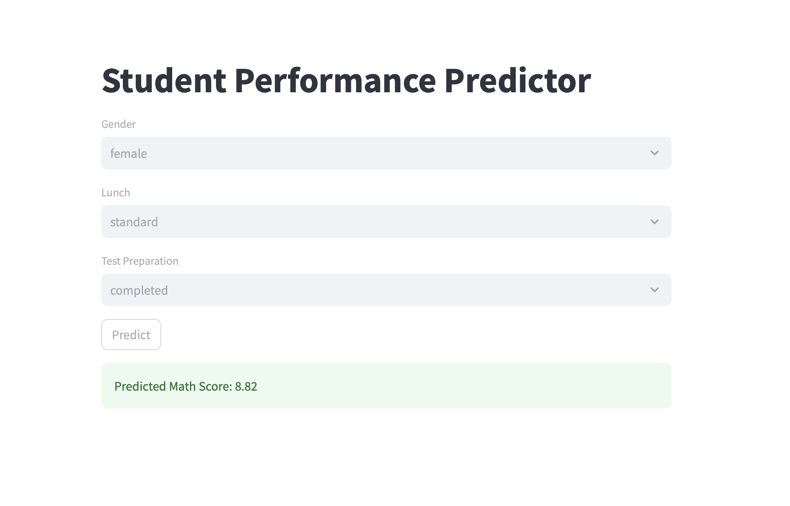

# 🎓 Student Performance Prediction

## 📌 Project Overview
This project predicts student math scores using machine learning based on factors like gender, lunch type, and test preparation.

---

## ⚙️ Tech Stack
- Python
- Pandas, NumPy
- Scikit-learn
- Streamlit

---

## 🔍 Workflow
1. Data Cleaning & Preprocessing  
2. Exploratory Data Analysis (EDA)  
3. Model Training (Random Forest Regressor)  
4. Model Evaluation using Mean Absolute Error  
5. Deployment using Streamlit  

---

## 📊 Results
- Mean Absolute Error: **~4.6 marks**
- Model predicts student performance with good accuracy

---

## 💡 Key Insights
- Students who completed test preparation performed better  
- Certain features strongly impact scores (visualized using heatmap)

---

## 🌐 Streamlit App
An interactive app where users can input details and get predicted scores.
## 📸 App Preview

## 🚀 Live Demo
https://your-app-link.streamlit.app
---

## 📁 Files
- `analysis.ipynb` – Data analysis & visualization  
- `ml_model.ipynb` – Model building  
- `app.py` – Streamlit web app  
- `StudentsPerformance.csv` – Dataset  

---

## 🚀 Future Improvements
- Add more input features  
- Improve model accuracy  
- Deploy app online  
